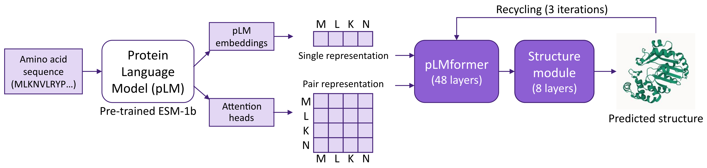
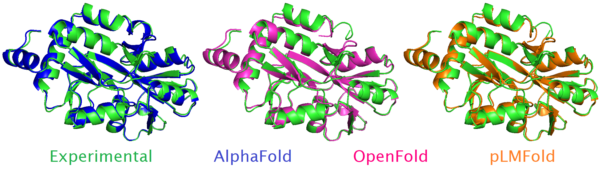

# ManyFold

[](https://docs.python.org/3.8/library/index.html)
[](https://jax.readthedocs.io/en/latest/)
[](LICENSE)

An efficient and flexible library in Jax for distributed training and batched validation of protein folding models.

## Description

ManyFold supports the [AlphaFold2](https://github.com/deepmind/alphafold) and [OpenFold](https://github.com/aqlaboratory/openfold) models. In addition, it also implements the pLMFold model, an MSA-free folding model using [ESM-1b](https://github.com/facebookresearch/esm) protein language model (pLM) embeddings and attention heads as inputs. A schematic of the pLMFold model is depicted below:



*Fig. 1: The pLMFold model: a pre-trained pLM model first converts the input amino acid sequence into single and pair representations that are processed in the pLMformer module. The output is then fed into the structure module to generate the predicted protein structure.*

ManyFold allows for training full AlphaFold/pLMFold models from either (i) randomly initialized parameters and optimizer state, (ii) a previously stored checkpoint, or (iii) pre-trained model parameters (for model fine-tuning). The library was used to train a pLMFold model from scratch, obtaining plausible protein structures (Fig. 2) while significantly reducing forward/backward times with respect to AlphaFold.



*Fig. 2: AlphaFold/OpenFold (`model_1_ptm`), and pLMFold predictions aligned to the experimental structure of the target with chain id 7EJG_C.*

## First-time setup

1. Clone this repository locally and `cd` into it:

```bash
git clone https://github.com/instadeepai/manyfold.git
cd manyfold
```

2. Download data for training and inference (see [`datasets/README.md`](datasets/README.md) for a description of the datasets):

```bash
mkdir -p datasets
curl -fsSL https://storage.googleapis.com/manyfold-data/datasets.tar | tar x -C datasets/
```

3. Download pLMFold/AlphaFold/OpenFold pretrained parameters. These are meant for validation inference or model fine-tuning:

```bash
# pLMFold
mkdir -p params
curl -fsSL https://storage.googleapis.com/manyfold-data/params.tar | tar x -C params/

# AlphaFold
mkdir -p params/alphafold
curl -fsSL https://storage.googleapis.com/alphafold/alphafold_params_2021-07-14.tar | tar x -C params/alphafold

# OpenFold
mkdir -p params/openfold
for i in 1 2; do
    wget -qnc https://files.ipd.uw.edu/krypton/openfold/openfold_model_ptm_${i}.npz -O params/openfold/params_model_${i}_ptm.npz
done
```

The easiest way to run ManyFold is using the docker files provided in the `docker` folder. For a detailed explanation on how to run experiments, please refer to [`experiments/README.md`](experiments/README.md). This involves two main steps:

- Build the docker image and run the docker contaienr.
- Launch training runs or validation inference.

## Acknowledgements

This research has been supported with TPUs from Google's TPU Research Cloud (TRC).

## Citing ManyFold

If you find this repository useful in your work, please add the following citation:

```bibtex
@software{manyfold2022github,
  author = {Amelia Villegas-Morcillo and Louis Robinson and Arthur Flajolet and Thomas D. Barrett},
  title = {{ManyFold}: An efficient and flexible library for training and validating protein folding models},
  year = {2022},
  url = {https://github.com/instadeepai/manyfold},
}
```
